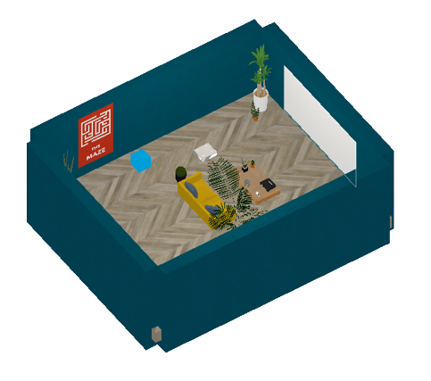

# VideoGame

Come back to [home](../Home.md)

### Contents

- [Description](#description)

- [Agent's Actions](#actions)

- [Brain](#brain)

- [Observations](#observations)

- [Reset](#Reset)

- [Reset's Parameters](#parameters)

- [Distraction](#distraction)

- [Next Steps](#next_steps)

  

## <a name="class">Information</a>

  

|            <a name="description">Description</a>             |  The agent can play 7 games : a maze, a tetris, a space invaders, a pong, a platform game, Cuphead and a random game. The agent has different actions depending on the game. For example, in the platform game, the agent can make the player jump, go left and right, climb a ladder and enable objects. In tetris, the agent can turn the tetrominos and speed up their descent. If the agent is not in front of the screen, the game pauses. To start a game, it has to enable the projector with a remote controller and catch a game in front of it poster.  |
| :----------------------------------------------------------: | :----------------------------------------------------------- |
|            <a name="actions">Agent's Actions</a>             |  The agent has 13 actions :  nothing (0) / go forward (1) / go backward (2) / turn left (3) / turn right (4) / enable something (5) / gamecontroller button up (6) / gamecontroller button down (7) / gamecontroller button left (8) / gamecontroller button right (9) / gamecontroller button A (10) / gamecontroller button B (11) / gamecontroller button start (12)  |
|                  <a name="brain">Brain</a>                   | The brain has only one branch : `observation, reward, done, info = env.step(0)` |
|       <a name="observations">Agent's Observations</a>        | The agent sends its observations (image 84x84) at each step  |
| <a name="informations">Informations stored in a dictionary</a> | The agent stores its **position**, the **name of the game loaded** and whether it is **playing or not** at each step |
|                  <a name="Reset">Reset</a>                   |  If the user wants to reset the environment. He can choose to **launch a game** at the beginning of the simulation.  |
|         <a name="parameters">Reset's Parameters</a>          | **load_game [0, 8]** : 0 none game is launched ; 1-8 launch a game at the beginning of the simulation |
|            <a name="distraction">Distraction</a>             | Some distractions are present in the games                   |

## <a name="next_steps">Next Steps</a>

Other environments : 

1. [PushBlocks](PushBlocks.md)
2. [Television](Television.md)
3. [MazeButtons (colored)](MazeButtonsColored.md)
4. [MazeButtons (textured)](MazeButtonsTextured.md)
5. [Drawing](Drawing.md)
6. [VideoGame](VideoGame)

or come back to [home](../Home.md)