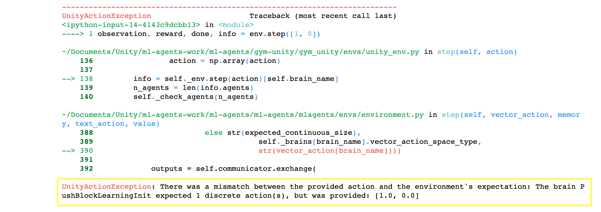
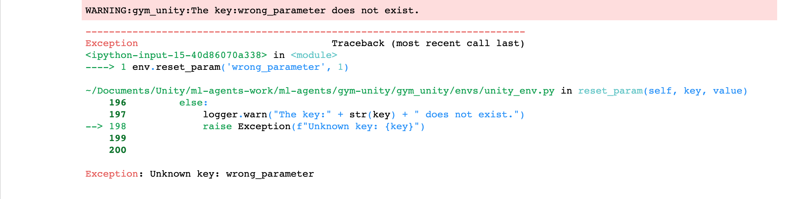

# Unity ML-Agents Gym Wrapper

A common way in which machine learning researchers interact with simulation environments is via a wrapper provided by OpenAI called `gym`. For more information on the gym interface, see [here](https://github.com/openai/gym).

ML-Agents provide a a gym wrapper, and instructions for using it. Both wrappers provide interfaces on top
of our `UnityEnvironment` class, which is the default way of interfacing with a Unity environment via Python.

## Using the Gym Wrapper

### Launch an environment

The gym interface is available from `gym_unity.envs`. To launch an environment
from the root of the project repository use:

```python
from gym_unity.envs import UnityEnv

env = UnityEnv(environment_filename, worker_id, use_visual, uint8_visual, multiagent)
```

- `environment_filename` refers to the path to the Unity environment.
- `worker_id` refers to the port to use for communication with the environment.
  Defaults to `0`.
- `use_visual` refers to whether to use visual observations (True) or vector
  observations (False) as the default observation provided by the `reset` and
  `step` functions. Defaults to `False`.
- `uint8_visual` refers to whether to output visual observations as `uint8` values 
  (0-255). Many common Gym environments (e.g. Atari) do this. By default they 
  will be floats (0.0-1.0). Defaults to `False`.
- `multiagent` refers to whether you intent to launch an environment which
  contains more than one agent. Defaults to `False`.

The returned environment `env` will function as a gym.


### Reset the environment and show the initial observation

The first step is to reset the environment which provided the initial observation of the environment.

```python
# Reset the environment
initial_observation = env.reset()

if len(env.observation_space.shape) == 1:
    # Examine the initial vector observation
    print("Agent state looks like: \n{}".format(initial_observation))
else:
    # Examine the initial visual observation
    print("Agent observations look like:")
    if env.observation_space.shape[2] == 3:
        plt.imshow(initial_observation[:,:,:])
    else:
        plt.imshow(initial_observation[:,:,0])
```


###Control the agent

Each agent has different actions. The shape and the size of the action vector depend on the brain of the agent. It could be a simple integer or a table.

```python
env.step(action)
```

* `action` : refers the action vector that allows the agent to do something or not. Each vector has a different size and shape.

```python
# Provide an action to the agent
observation, reward, done, info = env.step(0)

if len(env.observation_space.shape) == 1:
    # Examine the initial vector observation
    print("Agent state looks like: \n{}".format(observation))
else:
    # Examine the initial visual observation
    print("Agent observations look like:")
    if env.observation_space.shape[2] == 3:
        plt.imshow(observation[:,:,:])
    else:
        plt.imshow(observation[:,:,0])
```


We can also simply choose random actions using the `env.action_space.sample()` function.

```python
# Provide a radom action to the agent
observation, reward, done, info = env.step(env.action_space.sample())

if len(env.observation_space.shape) == 1:
    # Examine the initial vector observation
    print("Agent state looks like: \n{}".format(observation))
else:
    # Examine the initial visual observation
    print("Agent observations look like:")
    if env.observation_space.shape[2] == 3:
        plt.imshow(observation[:,:,:])
    else:
        plt.imshow(observation[:,:,0])
```


###Change the parameters of the reset

You can start a simulation by enabling or disabling parameters. Each environment has different editable parameters

```python
env.reset('name_of_parameter', value)
```

* `name_of_parameters` : refers to the name of the paramater to change. If the name does not exist, a warn message appears and the simulation stop.

* `value` : refers to the value that the parameters will take. In despite of this value, the environment will start differently. By default, the value 0 disables the parameter

  

## Limitation

- It is only possible to use an environment with a single Brain.
- By default the first visual observation is provided as the `observation`, if
  present. Otherwise vector observations are provided.
- All `BrainInfo` output from the environment can still be accessed from the
  `info` provided by `env.step(action)`.
- Stacked vector observations are not supported.
- Environment registration for use with `gym.make()` is currently not supported.


## Errors

###Action Error

If the shape of the action vector is wrong, the next warn appears and the simulation stops.

```python
observation, reward, done, info = env.step([1, 0])
```

<p align="center">
  
</p>


###Reset Parameter Error

If the name of the reset parameter does not exist, a warn appears and the simulation stops.

```python
env.reset_param('wrong_parameter', 1)
```

<p align="center">
  
</p>

