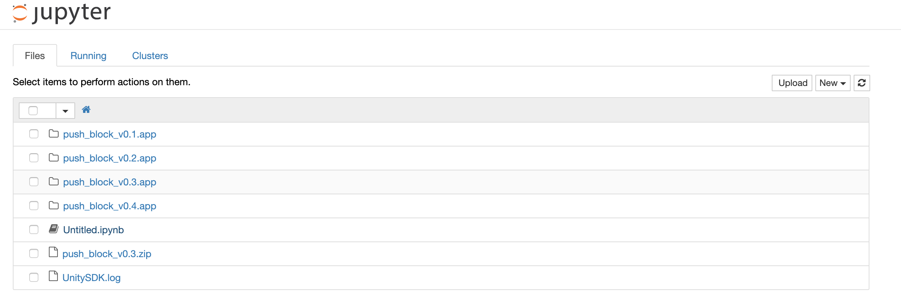
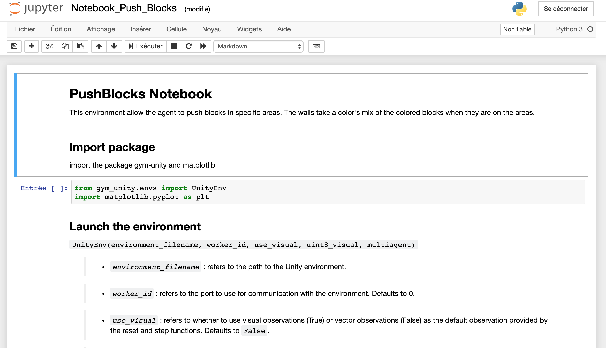

# Launch an environment (part 1/2)

The first part explain you how to launch an environment through a Jupyter Notebook and Gym commands

### The environments

Go in the main folder and enter the `environments` subdirectory. You will find 6 folders that correspond to the new environments. In each folder, you will find 6 files or folders :

* `.app` (Mac) and `x86_64` (Linux) files: these are the environments launched by the notebook. They contain an agent, a brain and an academy.
* `playable`: this folder contain the environment where the user can control the agent actions with the keyboard. It allow the user to test the environment.
* `description.md`: a description of the environment. The user will find a presentation of the environment but also the actions of the agent and the parameters editable before a reset.
* `.ipynb` file: the notebook that show you how to launch and interact with an Unity environment.


### Jupyter Notebook

Until the en of this part, we will work with the environment `PushBlocks`. Enter in the `PushBlocks ` subdirectory and run from the command line: (don't forgive to activate the virtual environment [create before](Anaconda_Install.md))

```bash
jupyter notebook
```

This command open a webpage. In this page, you will find the currently folder.



Open the notebook `notebook_push_blocks.ipynb`. You must have the window below: 




This page explain you how to launch the environment, reset it, control the agent and change the parameters before a reset. Don't forget to change the `environment_filename` in according to your operating system.

For more details about the command, go on the page [Gym-Unity Wrapper](Gym-Unity_Wrapper).

## Next Steps

The next step show you how to [run an environment]() with a notebook and the main command line to interact with it.

